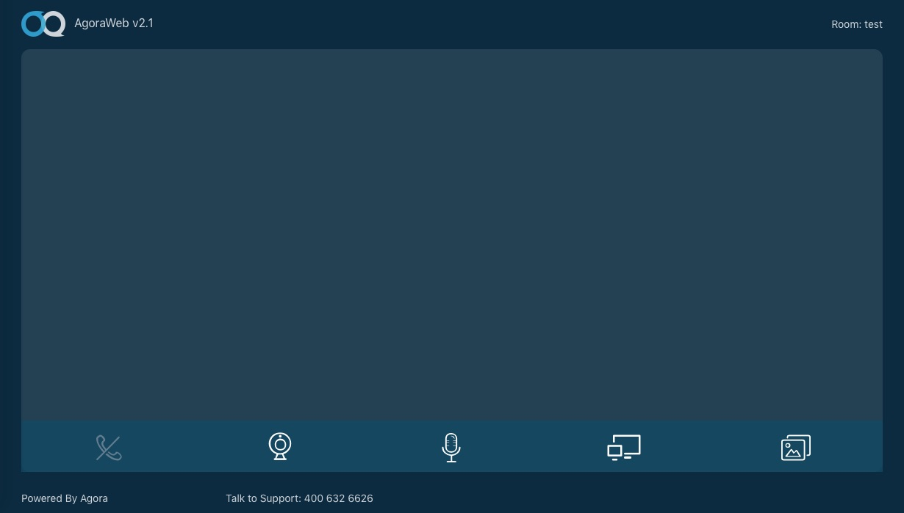

# Open Video Call React

This tutorial describes how to add video chat to your ReactJS applications using the AgoraRTC SDK.

With this sample app, you can:

- [Join a meeting room with up to 7 people](#add-mount-methods-for-the-agoracanvas-class)
- [Leave the meeting room](#add-custom-stream-methods-for-the-agoracanvas-class)
- [Disable/Enable audio](#add-other-custom-methods-for-the-agoracanvas-class)
- [Disable/Enable video](#add-other-custom-methods-for-the-agoracanvas-class)
- [Apply two layouts views](#add-the-update-method-for-the-agoracanvas-class)
- [Hide a remote window](#add-other-custom-methods-for-the-agoracanvas-class)

## Prerequisites

- Node.js 6.9.1+


## Quick Start

This section shows you how to prepare, build, and run the sample application.

- [Create an Account and Obtain an App ID](#create-an-account-and-obtain-an-app-id)
- [Update and Run the Sample Application](#update-and-run-the-sample-application) 


### Create an Account and Obtain an App ID
To build and run the sample application, you must obtain an app ID: 

1. Create a developer account at [agora.io](https://dashboard.agora.io/signin/). Once you finish the sign-up process, you are redirected to the dashboard.
2. Navigate in the dashboard tree on the left to **Projects** > **Project List**.
3. Copy the app ID that you obtained from the dashboard into a text file. You will use this when you launch the app.


### Update and Run the Sample Application 

1. Edit the [`src/agora.config.js`](src/agora.config.js) file. In the `AGORA_APP_ID` declaration, update `Your App ID` with your app ID.

```JavaScript
export const AGORA_APP_ID = 'Your App ID'
```

2. Download the [Agora Web Video SDK](https://www.agora.io/en/download/). Unzip the downloaded SDK package and copy the `AgoraRTC-*.js` file into the sample application's `/src/library/` folder. Rename the file to `AgoraRTC.js`.

	**Note:** CDN can now be used to retrieve the latest SDK. You do not have to re-download SDK updates.
		
3. Open the terminal and navigate to your project folder.

``` bash
cd path/to/project
```

4. Use `npm` to install the dependencies:

``` bash
# install dependency
npm install
```

5. Build and run the project:

Use `start` for a local build. View the application in your browser with the URL `http://localhost:3000`

```bash
# serve with hot reload at localhost:3000
npm run start
```
Use `build` for a production version with minification.

```bash
# build for production with minification
npm run build
```


## Steps to Create the Sample 

- [Add Assets](#add-assets)
- [Create Index Page](#create-index-page)
- [Create Meeting Page](#create-meeting-page)
- [Create AgoraVideoCall Component](#create-agoravideocall-component)

### Add Assets

The sample application uses assets located in the [`src/assets/images`](src/assets/images) folder.

Asset|Image|Description
---|---|---
`ag-index-background.png`||Main application background image.
`ag-logo.png`||Logo image for the application.
`avatar.png`||Avatar image for the application.
`ag-login.png`|<div style="background-color:grey; text-align:center; padding-top:4px"></div>|Image of a monitor, for login.
`ag-audience.png` and `ag-audience-active.png`|<div style="background-color:grey; text-align:center; padding-top:4px"></div><div style="text-align:center; padding-top:4px"></div>|Image of a person icon in a circle, to represent an audience member.
`ag-mic-s.png` and `ag-mic-active-s.png`|<div style="background-color:grey; text-align:center; padding-top:4px"></div><div style="text-align:center; padding-top:4px"></div>|Image of a microphone, to turn on/off audio.
`ag-video-s.png` and `ag-video-active-s.png`|<div style="background-color:grey; text-align:center; padding-top:4px"></div><div style="text-align:center; padding-top:4px"></div>|Video camera image, to turn on/off video.
`ag-oval.png` and `ag-oval-active.png`|<div style="background-color:grey; text-align:center; padding-top:4px"></div><div style="text-align:center; padding-top:4px"></div>|Circle image (empty and filled-in) to indicate selections.

### Create Index Page

The Index page is managed by the [src/pages/index/index.jsx](src/pages/index/index.jsx) file.

The Index page is comprised of four classes:

Class|Description
---|---
[`Index`](#create-the-index-class)|Main class for the index page. The other classes are used in the layout for this class.
[`InputChannel`](#add-the-inputchannel-class)|Text input manager for the channel name.
[`BaseOptions`](#add-the-baseoptions-class)|Chooser for the type of call.
[`AdvancedOptions`](#add-the-advancedoptions-class)|Chooser for video transcoding.

```JavaScript
import React from 'react'
import * as Cookies from 'js-cookie'

import '../../assets/fonts/css/icons.css'
import Validator from '../../utils/Validator'
import { RESOLUTION_ARR } from '../../utils/Settings'
import './index.css'

class Index extends React.Component {
	...
}
class InputChannel extends React.Component {
	...
}
class BaseOptions extends React.Component {
	...
}
class AdvancedOptions extends React.Component {
	...
}

...

export default Index
```

#### Create the Index Class

The `Index` class is main class for the index page.


```JavaScript
class Index extends React.Component {
  
  ...
  
}
```

- [Add the Constructor Method for the Index Class](#add-the-constructor-method-for-the-index-class)
- [Add Event Listeners for the Index Class](#add-event-listeners-for-the-index-class)
- [Add the Render Method for the Index Class](#add-the-render-method-for-the-index-class)

##### Add the Constructor Method for the Index Class

The `constructor()` method initializes the `state` properties for the class:

Property|Value|Description
---|---|---
`joinBtn`|`false`|Indicates if the **Join** button is enabled / disabled.
`channel`|Empty string|Name of the channel.
`baseMode`|`avc`|Indicates the current base mode for the call.
`transcode`|`interop`|Indicates the current transcoding setting.
`attendeeMode`|`video`|Indicates the current connection mode for the attendee.
`videoProfile`|`480p_4`|Indicates the current video profile setting.

```JavaScript
  constructor(props) {
    super(props)
    this.state = {
      joinBtn: false,
      channel: '',
      baseMode: 'avc',
      transcode: 'interop',
      attendeeMode: 'video',
      videoProfile: '480p_4',

    }
  }
```


##### Add Event Listeners for the Index Class

The `componentDidMount()` method initializes event listener for keyboard presses.

When a keyboard button is pressed, ensure `e.keyCode` is the **Enter** / **Return** key before executing `this.handleJoin()`.

```JavaScript
  componentDidMount() {
    window.addEventListener('keypress', (e) => {
      e.keyCode === 13 && this.handleJoin()
    })
  }
```

The `handleChannel()` method updates the `channel` and `joinBtn` state properties.

```JavaScript
  /**
   * 
   * @param {String} val 0-9 a-z A-Z _ only 
   * @param {Boolean} state 
   */
  handleChannel = (val, state) => {
    this.setState({
      channel: val,
      joinBtn: state
    })
  }
```

The `handleJoin()` method initiates joining the channel.

1. Ensure the `joinBtn` state is `false`, otherwise stop the method execution with a `return`.
2. Set a log for the `state` information using `console.log`.
3. Set cookies for the state properties `channel`, `baseMode`, `transcode`, `attendeeMode`, and `videoProfile`.
4. Transfer the user to the `meeting` page.

```JavaScript
  handleJoin = () => {
    if (!this.state.joinBtn) {
      return
    }
    console.log(this.state)
    Cookies.set('channel', this.state.channel)
    Cookies.set('baseMode', this.state.baseMode)
    Cookies.set('transcode', this.state.transcode)
    Cookies.set('attendeeMode', this.state.attendeeMode)
    Cookies.set('videoProfile', this.state.videoProfile)
    window.location.hash = "meeting"
  }
```

##### Add the Render Method for the Index Class

The `render()` method displays the UI for the index page in the `return()`.

The layout is comprised of three sections, specified by the class names `ag-header`, `ag-main`, and `ag-footer`.

The `ag-main` section contains the key login elements for the layout. The remaining code for this section is contained within the `section` sub-element.

The `ag-footer` section contains a `Powered By Agora` text and Agora contact information.


```JavaScript
  render() {
    return (
      <div className="wrapper index">
        <div className="ag-header"></div>
        <div className="ag-main">
          <section className="login-wrapper">
          
          ...
    	
          </section>
        </div>
        <div className="ag-footer">
          <a className="ag-href" href="https://www.agora.io">
            <span>Powered By Agora</span>
          </a>
          <div>
            <span>Interested in Agora video call SDK? Contact </span>
            <span className="ag-contact">sales@agora.io</span>
          </div>
        </div>
      </div>
    )
  }
```

The `login-header` section contains the Agora logo, application title, and the application motto / subtitle.

```JavaScript
            <div className="login-header">
              
              <p className="login-title">AgoraWeb v2.1</p>
              <p className="login-subtitle">Powering Real-Time Communications</p>
            </div>
```

The `login-body` section is divided into three main sections:

- The text input for the room name
- The call options
- The attendee mode options

```JavaScript
            <div className="login-body">
              <div className="columns">
                <div className="column is-12">
                
	                ...
                
                </div>
              </div>
              <div className="columns">
                <div className="column is-7">
                		
                		...
                		
                </div>
                <div className="column is-5">
                		
                		...
                		
                </div>
              </div>
              <div className="columns">
                <div className="column">
                		
                		...
                		
                </div>
              </div>
            </div>
```

The first section is a text input box for the room name / channel. The `InputChannel` element is nested within two `div` elements. The text input has `onChange` event listener which invokes the `this.handleChannel` method.

```JavaScript
              <div className="columns">
                <div className="column is-12">
                  <InputChannel onChange={this.handleChannel} placeholder="Input a room name here"></InputChannel>
                </div>
              </div>
```

The second section is contains a `BaseOptions` component and a `AdvancedOptions` component.

The `BaseOptions` component has an `onChange` event listener which updates the `baseMode` state value.

The `AdvancedOptions` component has two event listeners:

- An `onRadioChange` event listener which updates the `transcode` state value.
- An `OnSelectChange` event listener which updates the `videoProfile` state value.

```JavaScript
              <div className="columns">
                <div className="column is-7">
                  <BaseOptions
                    onChange={val => this.setState({ baseMode: val })}>
                  </BaseOptions>
                </div>
                <div className="column is-5">
                  <AdvancedOptions
                    onRadioChange={val => this.setState({ transcode: val })}
                    onSelectChange={val => this.setState({ videoProfile: val })}>
                  </AdvancedOptions>
                </div>
              </div>
```

The third section is contains a set of radio dials and supporting images and text labels. Each radio `input` element has an `onChange` event listener which updates the `attendeeMode` state value.

```JavaScript
              <div className="columns">
                <div className="column">
                  <div id="attendeeMode" className="control">
                    <label className="radio">
                      <input onChange={e => this.setState({ attendeeMode: e.target.value })}
                        value="video" type="radio"
                        name="attendee" defaultChecked />
                      <span className="radio-btn">
                      </span>
                      <span className="radio-img video">
                      </span>
                      <span className="radio-msg">Video Call : join with video call</span>
                    </label>
                    <br />
                    <label className="radio">
                      <input onChange={e => this.setState({ attendeeMode: e.target.value })}
                        value="audio-only" type="radio"
                        name="attendee" />
                      <span className="radio-btn">
                      </span>
                      <span className="radio-img audio">
                      </span>
                      <span className="radio-msg">Audio-only : join with audio call</span>
                    </label>
                    <br />
                    <label className="radio">
                      <input onChange={e => this.setState({ attendeeMode: e.target.value })}
                        value="audience" type="radio"
                        name="attendee" />
                      <span className="radio-btn">
                      </span>
                      <span className="radio-img audience">
                      </span>
                      <span className="radio-msg">Audience : join as an audience</span>
                    </label>
                  </div>
                </div>
              </div>
```

The footer for the `ag-main` section contains a **Join** button, designated by an `a` element. The **Join** button has an `onClick` event listener which invokes the `this.handleJoin` method. This button is set to enabled / disabled by the `joinBtn` state value.

```JavaScript
            <div className="login-footer">
              <a id="joinBtn"
                onClick={this.handleJoin}
                disabled={!this.state.joinBtn}
                className="ag-rounded button is-info">Join
                  </a>
            </div>
```

#### Add the InputChannel Class

The `InputChannel` class defines the room channel text input for the index page.

```JavaScript
class InputChannel extends React.Component {
  
  ...
  
}
```

- [Add the Constructor Method for the InputChannel Class](#add-the-constructor-method-for-the-inputchannel-class)
- [Add Validation and Event Listeners for the InputChannel Class](#add-validation-and-event-listeners-for-the-inputchannel-class)
- [Add the Render Method for the InputChannel Class](#add-the-render-method-for-the-inputchannel-class)

##### Add the Constructor for the InputChannel Class

The `constructor()` method initializes the state properties `errorMsg` and `state` to empty strings.

```JavaScript
  constructor(props) {
    super(props)
    this.state = {
      errorMsg: '',
      state: ''
    }
  }
```

##### Add Validation and Event Listeners for the InputChannel Class

The `validate()` method checks the string for the text input and updates the `state` and `errorMsg` properties if necessary.

Set both properties to an empty string.

```JavaScript
  validate = (val) => {
    this.setState({
      state: '',
      errorMsg: ''
    })
    
    ...
    
  }
```

Ensure the text input value is not empty using `Validator.isNonEmpty`. If the value is empty, update the `errorMsg` and `state` properties to inform the user that the text input should not be empty.

```JavaScript
    if (Validator.isNonEmpty(val.trim())) {
      this.setState({
        errorMsg: 'Cannot be empty!',
        state: 'is-danger'
      })
      return false
    }
```

Ensure the text input value at least `1` character long. If the value is shorter than `1` character, update the `errorMsg` and `state` properties to inform the user that the text input should be longer than `1` character.

```JavaScript
    else if (Validator.minLength(val.trim(), 1)) {
      this.setState({
        errorMsg: 'No shorter than 1!',
        state: 'is-danger'
      })
      return false
    }
```

Ensure the text input value `16` characters or shorter. If the value is longer than `16` characters, update the `errorMsg` and `state` properties to inform the user that the text input should no longer than `16` characters.

```JavaScript
    else if (Validator.maxLength(val.trim(), 16)) {
      this.setState({
        errorMsg: 'No longer than 16!',
        state: 'is-danger'
      })
      return false
    }
```

Ensure the text input value only contains valid characters. If invalid characters are found, update the `errorMsg` and `state` properties to inform the user that the text input should only contain letters, numbers, or the `_` character.

```JavaScript
    else if (Validator.validChar(val.trim())) {
      this.setState({
        state: 'is-danger',
        errorMsg: 'Only capital or lower-case letter, number and "_" are permitted!'
      })
      return false
    }
```

If the text input value passes all the validation tests, update the `state` property to `is-success` and return `true`.

```JavaScript
    else {
      this.setState({
        state: 'is-success'
      })
      return true
    }
```

The `handleChange()` method is invoked when the text input value is updated. Retrieve the `state` using `this.validate()`. Update the property change for the component using `this.props.onChange()`

```JavaScript
  handleChange = (e) => {
    let state = this.validate(e.target.value)
    this.props.onChange(e.target.value, state)
  }
```

##### Add the Render Method for the InputChannel Class

The `render()` method displays the UI for the `InputChannel` component.

Set the `validateIcon` value, based on the component's `state` property.

```JavaScript
  render() {
    let validateIcon = ''
    switch (this.state.state) {
      default:
      case '':
        validateIcon = ''; break;
      case 'is-success':
        validateIcon = (<i className="ag-icon ag-icon-valid"></i>); break;
      case 'is-danger':
        validateIcon = (<i className="ag-icon ag-icon-invalid"></i>); break;
    }
    
    ...
    
  }
```

The `return` contains the layout for the component. The key elements are comprised of the text input box, login button, validation icon, and validation error message.

The text `input` element is initialized with the component `placeholder` property. The `onInput` event listener triggers the `this.handleChange` method.

The validation icon and error message are updated as the text input box value is validated.

```JavaScript
    return (
      <div className="channel-wrapper control has-icons-left">
        <input onInput={this.handleChange}
          id="channel"
          className={'ag-rounded input ' + this.state.state}
          type="text"
          placeholder={this.props.placeholder} />
        <span className="icon is-small is-left">
          
        </span>
        <span className="validate-icon">
          {validateIcon}
        </span>
        <div className="validate-msg">
          {this.state.errorMsg}
        </div>
      </div>
    )
```

#### Add the BaseOptions Class

The `BaseOptions` class defines the base options component for the index page.

```JavaScript
class BaseOptions extends React.Component {

  ...
  
}
```

- [Add the Constructor Method for the BaseOptions Class](#add-the-constructor-method-for-the-baseoptions-class)
- [Add the Event Listener for the BaseOptions Class](#add-the-event-listener-for-the-baseoptions-class)
- [Add the Render Method for the BaseOptions Class](#add-the-render-method-for-the-baseoptions-class)

##### Add the Constructor Method for the BaseOptions Class

The `constructor()` method initializes the `_options` array and state properties `active` and `message`.

```JavaScript
  constructor(props) {
    super(props)
    this._options = [
      {
        label: 'Agora Video Call',
        value: 'avc',
        content: 'One to one and group calls'
      },
      {
        label: 'Agora Live',
        value: 'al',
        content: 'Enabling real-time interactions between the host and the audience'
      }
    ]
    this.state = {
      active: false,
      message: 'Agora Video Call',

    }
  }
```

##### Add the Event Listener for the BaseOptions Class

The `handleSelect()` method is invoked when a dropdown menu item is selected.

Update the state properties `message` and `active` with the selection values, and trigger the component's `onChange` event listener with `val`.

```JavaScript
  handleSelect = (item) => {
    let msg = item.label
    let val = item.value
    this.setState({
      'message': msg,
      'active': false
    })
    this.props.onChange(val)
  }
```

##### Add the Render Method for the BaseOptions Class

The `render()` method displays the UI for the `BaseOptions` component.

Create the `options` layout variable, by mapping through `this._options`, giving each option an item `label` and  `content` description wrapped in a `div` element.

Add an `onClick` event listener, which triggers the `this.handleSelect()` method for the item selection.

```JavaScript
  render() {
    const options = this._options.map((item, index) => {
      return (
        <div className="dropdown-item"
          key={index}
          onClick={(e) => this.handleSelect(item, e)}>
          <p>{item.label}</p>
          <hr />
          <p>{item.content}</p>
        </div>
      )
    })
```

The `return` contains the layout for the component. The component is enabled / disabled based on the state's `active` property.

When the dropdown button `dropdown-trigger` is clicked, set the dropdown menu to open/closed by updating the `active` property using `this.setState()`. The selection option is updated in the `baseOptionLabel` element using the `message` state property.

The `options` layout variable populates the items in the dropdown menu.

```JavaScript
    return (
      <div className={this.state.active ? 'dropdown is-active' : 'dropdown'}>
        <div className="dropdown-trigger"
          onClick={() => this.setState({ 'active': !this.state.active })}>
          <a id="baseMode" className="ag-rounded button" aria-haspopup="true" aria-controls="baseModeOptions">
            <span id="baseOptionLabel">{this.state.message}</span>
            <span className="icon is-small">
              <i className="ag-icon ag-icon-arrow-down" aria-hidden="true"></i>
            </span>
          </a>
        </div>
        <div className="dropdown-menu" id="baseModeOptions" role="menu">
          <div className="dropdown-content">
            {options}
          </div>
        </div>
      </div>
    )
  }
```

#### Add the AdvancedOptions Class

The `AdvancedOptions` class defines the advanced options component for the index page.

```JavaScript
class AdvancedOptions extends React.Component {
  
  ...
  
}
```

- [Add the Constructor Method for the AdvancedOptions Class](#add-the-constructor-method-for-the-advancedoptions)
- [Add Event Listeners for AdvancedOptions Class](#add-event-listeners-for-the-advancedoptions)
- [Add the Render Method for the AdvancedOptions Class](#add-the-render-method-for-the-advancedoptions)

##### Add the Constructor Method for the AdvancedOptions Class

The `constructor()` method initializes the state property `active` to `false`.

```JavaScript
  constructor(props) {
    super(props)
    this.state = {
      active: false,
    }
  }
```

##### Add Event Listeners for the AdvancedOptions Class

The `handleRadio()` method invokes the component's `onRadioChange()` method with the target `value`.

```JavaScript
  handleRadio = (e) => {
    this.props.onRadioChange(e.target.value)
  }
```

The `handleSelect()` method invokes the component's `onSelectChange()` method with the target `value`.

```JavaScript
  handleSelect = (e) => {
    this.props.onSelectChange(e.target.value)
  }
```

##### Add the Render Method for the AdvancedOptions Class

The `render()` method displays the UI for the `AdvancedOptions` component.

Create the `options` layout variable, by mapping through `Object.entries`, returning an `option` element with a specified `key`, `value`, and description for each item.

```JavaScript
  render() {
    const options = Object.entries(RESOLUTION_ARR).map((item, index) => {
      return (
        <option key={index} value={item[0].split(",")[0]}>{item[1][0]}x {item[1][1]}, {item[1][2]}fps, {item[1][3]}kbps</option>
      )
    })
    
    ...
    
  }
```

The `return` contains the layout for the component. The component is enabled / disabled based on the state's `active` property.

```JavaScript
    return (
      <div className={this.state.active ? 'dropdown is-active' : 'dropdown'}>
      		
      		...
      		
      </div>
    )
```

When the dropdown button `dropdown-trigger` is clicked, set the dropdown menu to open/closed by updating the `active` property using `this.setState()`.

```JavaScript
        <div className="dropdown-trigger"
          onClick={() => this.setState({ 'active': !this.state.active })}>
          <a id="advancedProfile" className="ag-rounded button" aria-haspopup="true" aria-controls="advancedOptions">
            <span>Advanced</span>
          </a>
        </div>
```

The advanced options dropdown menu contains transcoding `radio` input options and video profile options.

The transcoding radio options have an `onChange` event listener to invoke the `this.handleRadio` method.

The video profile selection menu is populated by the `options` layout variable. This menu has an `onChange` event listener which triggers the `this.handleSelect` method.

```JavaScript
        <div className="dropdown-menu" id="advancedOptions" role="menu">
          <div className="dropdown-content">
            <div className="dropdown-item">
              <div className="control">
                <label className="radio">
                  <input value="" type="radio" name="transcode" onChange={this.handleRadio} />
                  <span>VP8-only</span>
                </label>
                <label className="radio">
                  <input value="interop" type="radio" defaultChecked onChange={this.handleRadio} name="transcode" />
                  <span>VP8 &amp; H264</span>
                </label>
                <label className="radio">
                  <input value="h264_interop" type="radio" onChange={this.handleRadio} name="transcode" />
                  <span>H264-only</span>
                </label>
              </div>
            </div>
            <div className="dropdown-item">
              <div className="select is-rounded">
                <select onChange={this.handleSelect} defaultValue="480p_4" id="videoProfile" className="ag-rounded is-clipped">
                  {options}
                </select>
              </div>
            </div>
          </div>
        </div>
```

### Create Meeting Page

The Meeting page is managed by the [src/pages/meeting/index.jsx](src/pages/meeting/index.jsx) file.



The `Meeting` class defines the layout and controls for the meeting page.

```Javascript
import React from 'react'
import * as Cookies from 'js-cookie'

import './meeting.css'
import AgoraVideoCall from '../../components/AgoraVideoCall'
import {AGORA_APP_ID} from '../../agora.config'

class Meeting extends React.Component {
  
  ...
  
}

export default Meeting
```

- [Add the Constructor Method for the Meeting Class](#add-the-constructor-method-for-the-meeting-class)
- [Add the Render Method for the Meeting Class](#add-the-render-method-for-the-meeting-class)

#### Add the Constructor Method for the Meeting Class

The `constructor()` method sets the variables for the page.

The following variables are set using cookies, that were set from the index page. If the cookie value isn't found, a default value is used:

Variable|Cookie value|Default value|Description
---|---|---
`videoProfile`|`videoProfile`|`480p_4`|Video profile used for the connection.
`channel`|`channel`|`test`|Channel name.
`transcode`|`transcode`|`interop`|Video transcoding mode.
`attendeeMode`|`attendeeMode`|`video`|Attendee mode.
`baseMode`|`baseMode`|`avc`|Base mode for the connection.

Ensure `this.appId` is valid; otherwise display an `alert()` that an App ID is needed and stop execution.

Set `this.uid` to `undefined`.

```JavaScript
  constructor(props) {
    super(props)
    this.videoProfile = (Cookies.get('videoProfile')).split(',')[0] || '480p_4',
      this.channel = Cookies.get('channel') || 'test',
      this.transcode = Cookies.get('transcode') || 'interop',
      this.attendeeMode = Cookies.get('attendeeMode') || 'video',
      this.baseMode = Cookies.get('baseMode') || 'avc'
    this.appId = AGORA_APP_ID
    if (!this.appId) {
      return alert('Get App ID first!')
    }
    this.uid = undefined

  }
```

#### Add the Render Method for the Meeting Class

The `render()` method displays the UI for the `AdvancedOptions` component in the `return`. The layout is broken up into three main sections `ag-header`, `ag-main`, and `ag-footer`.

The header contains:

- The Agora logo.
- The application name and version.
- The room name / channel.

The main section contains the `AgoraVideoCall` component, and sets the properties based on the variables initialized in the constructor.

The footer section contains a `Powered By Agora` text, and Agora contact information.

```
  render() {
    return (
      <div className="wrapper meeting">
        <div className="ag-header">
          <div className="ag-header-lead">
            
            <span>AgoraWeb v2.1</span>
          </div>
          <div className="ag-header-msg">
            Room:&nbsp;<span id="room-name">{this.channel}</span>
          </div>
        </div>
        <div className="ag-main">
          <div className="ag-container">
            <AgoraVideoCall
              videoProfile={this.videoProfile}
              channel={this.channel}
              transcode={this.transcode}
              attendeeMode={this.attendeeMode}
              baseMode={this.baseMode}
              appId={this.appId}
              uid={this.uid}></AgoraVideoCall>
          </div>
        </div>
        <div className="ag-footer">
          <a className="ag-href" href="https://www.agora.io"><span>Powered By Agora</span></a>
          <span>Talk to Support: 400 632 6626</span>
        </div>
      </div>
    )
  }
```

### Create AgoraVideoCall Component

The AgoraVideoCall component is managed by the [src/components/AgoraVideoCall/index.jsx](src/components/AgoraVideoCall/index.jsx) file.

```
import React from 'react'
import { merge } from 'lodash'

import './canvas.css'
import '../../assets/fonts/css/icons.css'
```

- [Initialize the AgoraVideoCall Component](#initialize-the-agoravideocall-component)
- [Add the Constructor Method for the AgoraCanvas Class](#add-the-constructor-method-for-the-agoracanvas-class)
- [Add Mount Methods for the AgoraCanvas Class](#add-mount-methods-for-the-agoracanvas-class)
- [Add the Update Method for the AgoraCanvas Class](#add-the-update-method-for-the-agoracanvas-class)
- [Add the Render Method for the AgoraCanvas Class](#add-the-render-method-for-the-agoracanvas-class)
- [Add Custom Stream Methods for the AgoraCanvas Class](#add-custom-stream-methods-for-the-agoracanvas-class)
- [Add Other Custom Methods for the AgoraCanvas Class](#add-other-custom-methods-for-the-agoracanvas-class)

#### Initialize the AgoraVideoCall Component

The `tile_canvas` constant defines how to tile the video layout for the call.

```JavaScript
const tile_canvas = {
  '1': ['span 12/span 24'],
  '2': ['span 12/span 12/13/25', 'span 12/span 12/13/13'],
  '3': ['span 6/span 12', 'span 6/span 12', 'span 6/span 12/7/19'],
  '4': ['span 6/span 12', 'span 6/span 12', 'span 6/span 12', 'span 6/span 12/7/13'],
  '5': ['span 3/span 4/13/9', 'span 3/span 4/13/13', 'span 3/span 4/13/17', 'span 3/span 4/13/21', 'span 9/span 16/10/21'],
  '6': ['span 3/span 4/13/7', 'span 3/span 4/13/11', 'span 3/span 4/13/15', 'span 3/span 4/13/19', 'span 3/span 4/13/23', 'span 9/span 16/10/21'],
  '7': ['span 3/span 4/13/5', 'span 3/span 4/13/9', 'span 3/span 4/13/13', 'span 3/span 4/13/17', 'span 3/span 4/13/21', 'span 3/span 4/13/25', 'span 9/span 16/10/21'],
}
```

The `AgoraCanvas` class defines the layout and controls for the `AgoraCanvas` component.

```JavaScript
/**
 * @prop appId uid
 * @prop transcode attendeeMode videoProfile channel baseMode
 */
class AgoraCanvas extends React.Component {

  ...
  
}

export default AgoraCanvas
```

#### Add the Constructor Method for the AgoraCanvas Class

The `constructor()` method initializes the `client`, `localStream`, `shareClient`, and `shareStream` variables and the state properties `displayMode`, `streamList`, and `readyState`.

```JavaScript
  constructor(props) {
    super(props)
    this.client = {}
    this.localStream = {}
    this.shareClient = {}
    this.shareStream = {}
    this.state = {
      displayMode: 'pip',
      streamList: [],
      readyState: false
    }
  }
```

#### Add Mount Methods for the AgoraCanvas Class

The `componentWillMount()` method initializes the Agora RTC engine and joins the user to the specified channel.

Create the Agora RTC client using `AgoraRTC.createClient()`.

```JavaScript
  componentWillMount() {
    let $ = this.props
    // init AgoraRTC local client
    this.client = AgoraRTC.createClient({ mode: $.transcode })
    
    ...
  		
  }
```

1. Initialize the Agora RTC client using `this.client.init()` and log the initialization confirmation using `console.log()`.
2. Subscribe to the stream events using `this.subscribeStreamEvents()`.
3. Join the channel using `this.client.join()` and log the join confirmation using `console.log()`.

The next section of code occurs within the `join()` method completion.

```JavaScript
    this.client.init($.appId, () => {
      console.log("AgoraRTC client initialized")
      this.subscribeStreamEvents()
      this.client.join($.appId, $.channel, $.uid, (uid) => {
        console.log("User " + uid + " join channel successfully")
        console.log('At ' + new Date().toLocaleTimeString())
        
        ...
      
      })
    })
```

1. Create the local stream using `this.streamInit()`.
2. Initialize the local stream using `this.localStream.init()`.

	- If the initialization is successful, add the local stream using `this.addStream()` and publish the stream using `this.client.publish()`.
	- If the initialization is not successful, log the error using `console.log()` and update the `readyState` state property.

```JavaScript
        // create local stream
        // It is not recommended to setState in function addStream
        this.localStream = this.streamInit(uid, $.attendeeMode, $.videoProfile)
        this.localStream.init(() => {
          if ($.attendeeMode !== 'audience') {
            this.addStream(this.localStream, true)
            this.client.publish(this.localStream, err => {
              console.log("Publish local stream error: " + err);
            })
          }
          this.setState({ readyState: true })
        },
          err => {
            console.log("getUserMedia failed", err)
            this.setState({ readyState: true })
          })
```

The `componentDidMount()` method initializes an event listener for the control button area.

1. Declare `canvas` and `btnGroup` to reference the layout canvas and buttons.
2. Add a `mousemove` event listener to the canvas using `canvas.addEventListener()`.

	1. If `global._toolbarToggle` is true, clear the toolbar timer using `clearTimeout()`.
	2. Add the `active` class to `btnGroup` using `classList.add()`.
	3. Start a new `2000` millisecond timer using `setTimeout()`, which will remove the `active` class from `btnGroup` using `classList.remove()`.

```JavaScript
  componentDidMount() {
    // add listener to control btn group
    let canvas = document.querySelector('#ag-canvas')
    let btnGroup = document.querySelector('.ag-btn-group')
    canvas.addEventListener('mousemove', () => {
      if (global._toolbarToggle) {
        clearTimeout(global._toolbarToggle)
      }
      btnGroup.classList.add('active')
      global._toolbarToggle = setTimeout(function () {
        btnGroup.classList.remove('active')
      }, 2000)
    })
  }
```

The `componentWillUnmount()` method closes the stream and exits the channel.

1. If `this.client` is valid, unpublish the local stream using `this.client.unpublish()`.
2. If `this.localStream` is valid, close the local stream using `this.localStream.close()`.
3. If `this.client` is valid, leave the channel using `this.client.leave()` and log the results using `console.log()`.

```JavaScript
  componentWillUnmount () {
    this.client && this.client.unpublish(this.localStream)
    this.localStream && this.localStream.close()
    this.client && this.client.leave(() => {
      console.log('Client succeed to leave.')
    }, () => {
      console.log('Client failed to leave.')
    })
  }
```

#### Add the Update Method for the AgoraCanvas Class

The `componentDidUpdate()` method triggers when the component updates.

Declare `canvas` to reference the updated layout canvas.

```JavaScript
  componentDidUpdate() {
    // rerendering
    let canvas = document.querySelector('#ag-canvas')
    
    ...
  		
  }
```

If `this.state.displayMode` is in `pip` mode, ensure the number of streams is greater than `4`; otherwise set the `displayMode` state to `tile` and end execution.

For each item in `this.state.streamList`:

1. Retrieve the ID of the item using `item.getId()`.
2. Retrieve the UI element for the item using `document.querySelector()`.
3. Ensure the UI element exists:
	1. Create a new `section` element using `document.createElement()`.
	2. Set the `id` and `class` attributes for the element using `dom.setAttribute()`.
	3. Append the element to the `canvas` using `appendChild()`.
	4. Play the stream using `item.play()`.
4. Set the `style` attribute using `dom.setAttribute()`, based on if the item is the last element in `this.state.streamList`.
5. Ensure `item.player.resize` is valid and resize the player using `item.player.resize()`.

```JavaScript
    // pip mode (can only use when less than 4 people in channel)
    if (this.state.displayMode === 'pip') {
      let no = this.state.streamList.length
      if (no > 4) {
        this.setState({ displayMode: 'tile' })
        return
      }
      this.state.streamList.map((item, index) => {
        let id = item.getId()
        let dom = document.querySelector('#ag-item-' + id)
        if (!dom) {
          dom = document.createElement('section')
          dom.setAttribute('id', 'ag-item-' + id)
          dom.setAttribute('class', 'ag-item')
          canvas.appendChild(dom)
          item.play('ag-item-' + id)
        }
        if (index === no - 1) {
          dom.setAttribute('style', `grid-area: span 12/span 24/13/25`)
        }
        else {
          dom.setAttribute('style', `grid-area: span 3/span 4/${4 + 3 * index}/25;
                    z-index:1;width:calc(100% - 20px);height:calc(100% - 20px)`)
        }

        item.player.resize && item.player.resize()


      })
    }
```

If `this.state.displayMode` is in `tile` mode, retrieve the number of streams using `this.state.streamList.length`.

For each item in `this.state.streamList`:

1. Retrieve the ID of the item using `item.getId()`.
2. Retrieve the UI element for the item using `document.querySelector()`.
3. Ensure the UI element exists:
	1. Create a new `section` element using `document.createElement()`.
	2. Set the `id` and `class` attributes for the element using `dom.setAttribute()`.
	3. Append the element to the `canvas` using `appendChild()`.
	4. Play the stream using `item.play()`.
4. Set the `style` attribute using `dom.setAttribute()`.
5. Ensure `item.player.resize` is valid and resize the player using `item.player.resize()`.

```JavaScript
    // tile mode
    else if (this.state.displayMode === 'tile') {
      let no = this.state.streamList.length
      this.state.streamList.map((item, index) => {
        let id = item.getId()
        let dom = document.querySelector('#ag-item-' + id)
        if (!dom) {
          dom = document.createElement('section')
          dom.setAttribute('id', 'ag-item-' + id)
          dom.setAttribute('class', 'ag-item')
          canvas.appendChild(dom)
          item.play('ag-item-' + id)
        }
        dom.setAttribute('style', `grid-area: ${tile_canvas[no][index]}`)
        item.player.resize && item.player.resize()


      })
    }
```

If `this.state.displayMode` is in `tbd` mode, do nothing as screen share mode has not been enabled in this sample application.

```JavaScript
    // screen share mode (tbd)
    else if (this.state.displayMode === 'share') {

    }
```

#### Add the Render Method for the AgoraCanvas Class

The `render()` method displays the UI for the `AgoraCanvas`.

```JavaScript
  render() {
  		
  		...
  		
  }
```

The `style` constant provides style settings for the layout.

```JavaScript
    const style = {
      display: 'grid',
      gridGap: '10px',
      alignItems: 'center',
      justifyItems: 'center',
      gridTemplateRows: 'repeat(12, auto)',
      gridTemplateColumns: 'repeat(24, auto)'
    }
```

The `videoControlBtn` constant provides a UI button to enable / disable video, if the `attendeeMode` is set to `video`.

The button has an `onClick` event listener that invokes the `this.handleCamera` method.

```JavaScript
    const videoControlBtn = this.props.attendeeMode === 'video' ?
      (<span
        onClick={this.handleCamera}
        className="ag-btn videoControlBtn"
        title="Enable/Disable Video">
        <i className="ag-icon ag-icon-camera"></i>
        <i className="ag-icon ag-icon-camera-off"></i>
      </span>) : ''
```

The `audioControlBtn` constant provides a UI button to enable / disable audio, if the `attendeeMode` is set to `audience`.

The button has an `onClick` event listener that invokes the `this.handleMic` method.

```JavaScript
    const audioControlBtn = this.props.attendeeMode !== 'audience' ?
      (<span
        onClick={this.handleMic}
        className="ag-btn audioControlBtn"
        title="Enable/Disable Audio">
        <i className="ag-icon ag-icon-mic"></i>
        <i className="ag-icon ag-icon-mic-off"></i>
      </span>) : ''
```

The `switchDisplayBtn` constant provides a UI button to switch display modes.

The button has an `onClick` event listener that invokes the `this.switchDisplay` method.

This button is disabled if `this.state.streamList.length` is greater than `4`; otherwise it is enabled.

```JavaScript
    const switchDisplayBtn = (
      <span
        onClick={this.switchDisplay}
        className={this.state.streamList.length > 4 ? "ag-btn displayModeBtn disabled" : "ag-btn displayModeBtn"}
        title="Switch Display Mode">
        <i className="ag-icon ag-icon-switch-display"></i>
      </span>
    )
```

The `hideRemoteBtn` constant provides a UI button to hide the remote stream.

This button is disabled if `this.state.streamList.length` is greater than `4` or `this.state.displayMode` does not equal `pip`; otherwise it is enabled.

The button has an `onClick` event listener that invokes the `this.hideRemote` method.

```JavaScript
    const hideRemoteBtn = (
      <span
        className={this.state.streamList.length > 4 || this.state.displayMode !== 'pip' ? "ag-btn disableRemoteBtn disabled" : "ag-btn disableRemoteBtn"}
        onClick={this.hideRemote}
        title="Hide Remote Stream">
        <i className="ag-icon ag-icon-remove-pip"></i>
      </span>
    )
```

The `exitBtn` constant provides a UI button to exit the room / channel.

The button has an `onClick` event listener that invokes the `this.handleExit` method.

This button is enabled if `this.state.readyState` is `true`; otherwise it is disabled.


```JavaScript
    const exitBtn = (
      <span
        onClick={this.handleExit}
        className={this.state.readyState ? 'ag-btn exitBtn' : 'ag-btn exitBtn disabled'}
        title="Exit">
        <i className="ag-icon ag-icon-leave"></i>
      </span>
    )
```

The `return` provides the layout for the `AgoraCanvas` component.

Add the `exitBtn`, `videoControlBtn`, `audioControlBtn`, `switchDisplayBtn`, and `hideRemoteBtn` layout values in a set of nested `div` elements.

```JavaScript
    return (
      <div id="ag-canvas" style={style}>
        <div className="ag-btn-group">
          {exitBtn}
          {videoControlBtn}
          {audioControlBtn}
          {/* <span className="ag-btn shareScreenBtn" title="Share Screen">
                        <i className="ag-icon ag-icon-screen-share"></i>
                    </span> */}
          {switchDisplayBtn}
          {hideRemoteBtn}
        </div>
      </div>
    )
```

#### Add Custom Stream Methods for the AgoraCanvas Class

The `streamInit()` method initializes a video stream.

1. Initialize a default configuration object with `streamID`, `audio`, `video`, and `screen` properties.
2. If the `attendeeMode` is audio only, set `defaultConfig.video` to `false`. If the `attendeeMode` is `audience`, set `defaultConfig.video` and `defaultConfig.audio` to `false`.
3. Create a stream with the configuration using `AgoraRTC.createStream()`.
4. Set the video profile using `stream.setVideoProfile()` and return the resulting `stream`.

```JavaScript
  streamInit = (uid, attendeeMode, videoProfile, config) => {
    let defaultConfig = {
      streamID: uid,
      audio: true,
      video: true,
      screen: false
    }

    switch (attendeeMode) {
      case 'audio-only':
        defaultConfig.video = false
        break;
      case 'audience':
        defaultConfig.video = false
        defaultConfig.audio = false
        break;
      default:
      case 'video':
        break;
    }

    let stream = AgoraRTC.createStream(merge(defaultConfig, config))
    stream.setVideoProfile(videoProfile)
    return stream
  }
```

The `subscribeStreamEvents()` method adds event listeners to the streams:

Event Listener|Description|Execution after trigger
---|---|---
`stream-added`|Triggers when a stream is added.|Add logs for the stream using `console.log` and subscribe the stream to the client using `rt.client.subscribe()`.
`peer-leave`|Triggers when a peer leaves the room / channel.|Add logs for the stream using `console.log` and remove the stream using `rt.removeStream()`.
`stream-subscribed`|Triggers when a stream is subscribed to the client.|Add logs for the stream using `console.log` and add the stream using `rt.addStream()`.
`stream-removed`|Triggered when a stream is removed from the client.|Add logs for the stream using `console.log` and remove the stream using `rt.removeStream()`.

```JavaScript
  subscribeStreamEvents = () => {
    let rt = this
    rt.client.on('stream-added', function (evt) {
      let stream = evt.stream
      console.log("New stream added: " + stream.getId())
      console.log('At ' + new Date().toLocaleTimeString())
      console.log("Subscribe ", stream)
      rt.client.subscribe(stream, function (err) {
        console.log("Subscribe stream failed", err)
      })
    })

    rt.client.on('peer-leave', function (evt) {
      console.log("Peer has left: " + evt.uid)
      console.log(new Date().toLocaleTimeString())
      console.log(evt)
      rt.removeStream(evt.uid)
    })

    rt.client.on('stream-subscribed', function (evt) {
      let stream = evt.stream
      console.log("Got stream-subscribed event")
      console.log(new Date().toLocaleTimeString())
      console.log("Subscribe remote stream successfully: " + stream.getId())
      console.log(evt)
      rt.addStream(stream)
    })

    rt.client.on("stream-removed", function (evt) {
      let stream = evt.stream
      console.log("Stream removed: " + stream.getId())
      console.log(new Date().toLocaleTimeString())
      console.log(evt)
      rt.removeStream(stream.getId())
    })
  }
```

The `removeStream()` method, removes the stream for the specified `uid`.

For each stream in `this.state.streamList`, find the stream ID that matches `uid`.

1. Close the item using `item.close()`.
2. Retrieve the layout element using `document.querySelector()`. If the element is valid, remove it from the layout using `element.parentNode.removeChild()`.
3. Create a `tempList` object for the list of streams and remove the current stream using `tempList.splice()`.
4. Update the `streamList` state property with `tempList`.

```JavaScript
  removeStream = (uid) => {
    this.state.streamList.map((item, index) => {
      if (item.getId() === uid) {
        item.close()
        let element = document.querySelector('#ag-item-' + uid)
        if (element) {
          element.parentNode.removeChild(element)
        }
        let tempList = [...this.state.streamList]
        tempList.splice(index, 1)
        this.setState({
          streamList: tempList
        })
      }

    })
  }
```

The `addStream()` method adds a stream.

Ensure the added stream does not exist in `this.state.streamList` before continuing execution.

If `push` is `true`, append `stream` to the stream list using `this.state.streamList.concat()` and update the `streamList` state property. 

Otherwise, prepend `stream` to the stream list using `[stream].concat()` and update the `streamList` state property.

```JavaScript
  addStream = (stream, push = false) => {
    let repeatition = this.state.streamList.some(item => {
      return item.getId() === stream.getId()
    })
    if (repeatition) {
      return
    }
    if (push) {
      this.setState({
        streamList: this.state.streamList.concat([stream])
      })
    }
    else {
      this.setState({
        streamList: [stream].concat(this.state.streamList)
      })
    }

  }
```

#### Add Other Custom Methods for the AgoraCanvas Class

The `handleCamera()` method enables / disables the camera.

1. Update the class for the trigger target using `e.currentTarget.classList.toggle()`.
2. Disable or enable the video using `this.localStream.disableVideo()` or `this.localStream.enableVideo()` based on `this.localStream.isVideoOn()`.

```JavaScript
  handleCamera = (e) => {
    e.currentTarget.classList.toggle('off')
    this.localStream.isVideoOn() ?
      this.localStream.disableVideo() : this.localStream.enableVideo()
  }
```

The `handleMic()` method enables / disables the microphone / audio.

1. Update the class for the trigger target using `e.currentTarget.classList.toggle()`.
2. Disable or enable the audio using `this.localStream.disableAudio()` or `this.localStream.enableAudio()` based on `this.localStream.isAudioOn()`.

```JavaScript
  handleMic = (e) => {
    e.currentTarget.classList.toggle('off')
    this.localStream.isAudioOn() ?
      this.localStream.disableAudio() : this.localStream.enableAudio()
  }
```

The `switchDisplay()` method switches displays.

Ensure the trigger target is not disabled `e.currentTarget.classList.contains()` and the stream list is greater than `1` before continuing execution.

Update the `displayMode` state property using `this.setState()` based on value of `this.state.displayMode`:

Current Display Mode Value|New Display Mode Value
---|---
`pip`|`tile`
`tile`|`php`
`share`|No change
Other|Log an error using `console.error()`.

```JavaScript
  switchDisplay = (e) => {
    if (e.currentTarget.classList.contains('disabled') || this.state.streamList.length <= 1) {
      return
    }
    if (this.state.displayMode === 'pip') {
      this.setState({ displayMode: 'tile' })
    }
    else if (this.state.displayMode === 'tile') {
      this.setState({ displayMode: 'pip' })
    }
    else if (this.state.displayMode === 'share') {
      // do nothing or alert, tbd
    }
    else {
      console.error('Display Mode can only be tile/pip/share')
    }
  }
```

The `hideRemote()` method hides the remote stream.

Ensure the trigger target is not disabled `e.currentTarget.classList.contains()` and the stream list is greater than `1` before continuing execution.

1. Declare `list` 
2. Retrieve the ID of the last stream in the list using `getId()`.
3. Update `list` with the array of all layout items matching the ID using `Array.from()`.
4. For each item in `list`, update the display using `item.style.display`. The value of the `display` is `none` if `item.style.display` equals `none`; otherwise the value is `block`.

```JavaScript
  hideRemote = (e) => {
    if (e.currentTarget.classList.contains('disabled') || this.state.streamList.length <= 1) {
      return
    }
    let list
    let id = this.state.streamList[this.state.streamList.length - 1].getId()
    list = Array.from(document.querySelectorAll(`.ag-item:not(#ag-item-${id})`))
    list.map(item => {
      if (item.style.display !== 'none') {
        item.style.display = 'none'
      }
      else {
        item.style.display = 'block'
      }
    })

  }
```

The `handleExit()` method exits the room / channel.

Ensure the trigger target is not disabled `e.currentTarget.classList.contains()` before continuing execution.

1. Ensure `this.client` is valid and unpublish the stream using `this.client.unpublish()` 
2. Ensure `this.localStream` is valid and close the stream using `this.localStream.close()` 
3. Ensure `this.client` is valid and leave the room / channel using `this.client.leave()` 
4. Update the `readyState` state property to `false`.
5. Set `this.client` and `this.localStream` to `null`.
6. Redirect the window to the index page using `window.location.hash`.

```JavaScript
  handleExit = (e) => {
    if (e.currentTarget.classList.contains('disabled')) {
      return
    }
    try {
      this.client && this.client.unpublish(this.localStream)
      this.localStream && this.localStream.close()
      this.client && this.client.leave(() => {
        console.log('Client succeed to leave.')
      }, () => {
        console.log('Client failed to leave.')
      })
    }
    finally {
      this.setState({ readyState: false })
      this.client = null
      this.localStream = null
      // redirect to index
      window.location.hash = ''
    }
  }
```

## Resources
- Find full API documentation in the [Document Center](https://docs.agora.io/en/).
- [File bugs about this sample](https://github.com/AgoraIO/OpenAgoraWeb-React/issues).

## Learn More
- Agora Video SDK sample OpenVideoCall for [Vue](https://github.com/AgoraIO/OpenAgoraWeb-Vue) is also available.

## License
This software is licensed under the MIT License (MIT). [View the license](LICENSE.md).